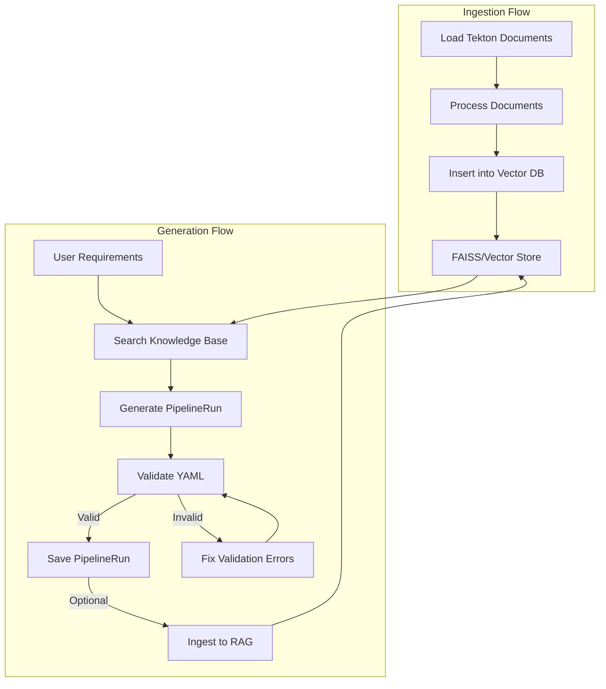

# Tekton Genie

A smart Tekton PipelineRun generator and validator powered by LlamaStack and RAG (Retrieval-Augmented Generation).

## Overview

Tekton Genie is an AI-powered tool that helps you generate, validate, and manage Tekton PipelineRuns. It uses a combination of vector database storage and large language models to understand Tekton documentation and generate valid pipelinerun configurations and leverages AI agent to validate the generated PipelineRun YAML.

## Features

- 📚 **Document Ingestion**: Automatically processes and indexes Tekton documentation for contextual understanding
- 🔧 **Pipelinerun Generation**: Creates Tekton PipelineRuns based on natural language requirements
- ✅ **Validation**: Built-in YAML validation and external validator support
- 🛠️ **Auto-fixing**: Automatically analyzes and fixes common validation errors
### Future Scope
- 📝 **RAG Integration**: Uses Retrieval-Augmented Generation for context-aware pipelinerun creation

## Components

### 1. Document Ingestion (`ingest_tekton_data.py`)

This component handles the ingestion of Tekton documentation into a vector database:

- Supports multiple document formats (.md, .txt, .pdf, .html, .docx, .pptx, .csv, .json, .yaml, .yml)
- Processes documents into chunks for efficient retrieval
- Stores documents with metadata in a vector database (FAISS by default)

### 2. PipelineRun Generation (`generate_tekton_pipeline.py`)

The main pipelineRun generation tool that:

- Accepts natural language requirements for pipelinerun creation
- Searches the knowledge base for relevant examples and context
- Generates valid Tekton PipelineRun configurations
- Validates and fixes common errors

#### Validation and Auto-fixing Workflow:

1. **Initial Generation**: Creates a PipelineRun based on user requirements
2. **YAML Validation**: 
   - Performs basic YAML syntax validation
   - Checks for required Tekton fields and structure
   - Optionally uses external Tekton validator for deep validation
3. **Auto-fixing Process**:
   - If validation fails, analyzes the error messages
   - Automatically generates fixes using context from the knowledge base
   - Re-validates the fixed PipelineRun
   - Presents the fixed version for user approval
4. **Save and Export**:
   - Saves the validated PipelineRun to a YAML file
   - Optionally ingests successful generations into the knowledge base

## Prerequisites

1. **Python Environment**:
   - Python 3.8+
   - UV package installer: 
     ```bash
     curl -LsSf https://astral.sh/uv/install.sh | sh
     ```

2. **LlamaStack Server**:
   - Runs on http://localhost:8321 by default
   - Start the server using Docker:
     ```bash
     export GEMINI_API_KEY=<your-api-key>
     docker run -it --rm \
       -v ./gemini.yaml:/app/gemini.yaml:z \
       -v ${SQLITE_STORE_DIR:-~/.llama/distributions/gemini}:/data \
       -e GEMINI_API_KEY=$GEMINI_API_KEY \
       -e SQLITE_STORE_DIR=/data \
       -p 8321:8321 \
       docker.io/llamastack/distribution-starter \
       --config gemini.yaml
     ```

3. **Go Environment** (for validator):
   - Required for building the Tekton validator binary
   - Go 1.x or later

## Installation

1. **Clone the Repository**:
   ```bash
   git clone https://github.com/redhat-ai-tools/tekton-genie
   cd tekton-genie
   ```

2. **Build the Validator**:
   ```bash
   cd validator
   go build -o validator_bin
   mv validator_bin ../
   cd ..
   ```

## Usage

### 1. Start LlamaStack Server

Ensure the LlamaStack server is running using the Docker command from the Prerequisites section before proceeding with the following steps.

### 2. Ingest Documentation

This step processes the Tekton documentation and stores it in the vector database:

```bash
uv run --with llama-stack-client ingest_tekton_data.py
```

### 3. Generate PipelineRuns

   ```bash
   uv run --with llama-stack-client generate_tekton_pipeline.py [--validator PATH] [--no-ingest]
   ```
   ex:
   ```bash
   uv run --with llama-stack-client generate_tekton_pipeline.py --validator ./validator_bin
   ```

#### Command Options:
- `--validator PATH`: Specify path to the Tekton validator binary
- `--no-ingest`: Skip ingesting successful PipelineRuns back to RAG system

#### Generation Process:
1. The tool will prompt you for your PipelineRun requirements in natural language
2. It will generate a PipelineRun based on your requirements
3. If validation is enabled, it will validate and potentially fix any issues
4. You can review, approve, and save the generated PipelineRun

## Flow Diagram



## Environment Variables

- `VECTOR_STORE`: Vector store provider (default: 'faiss')
